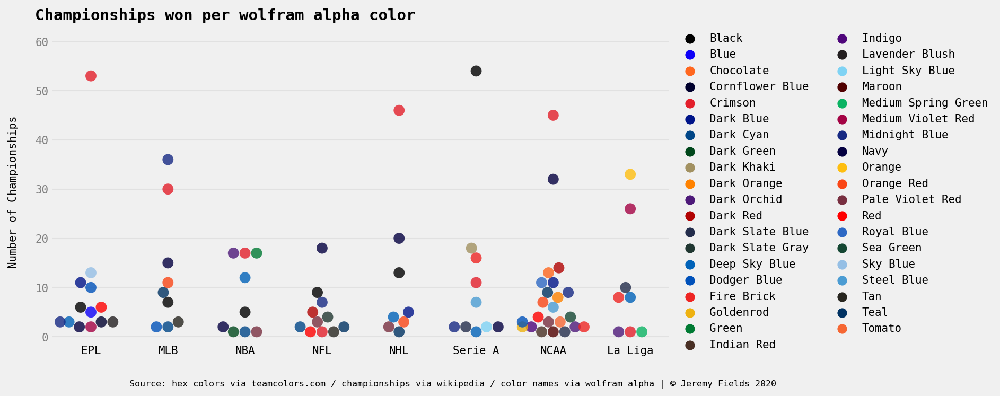
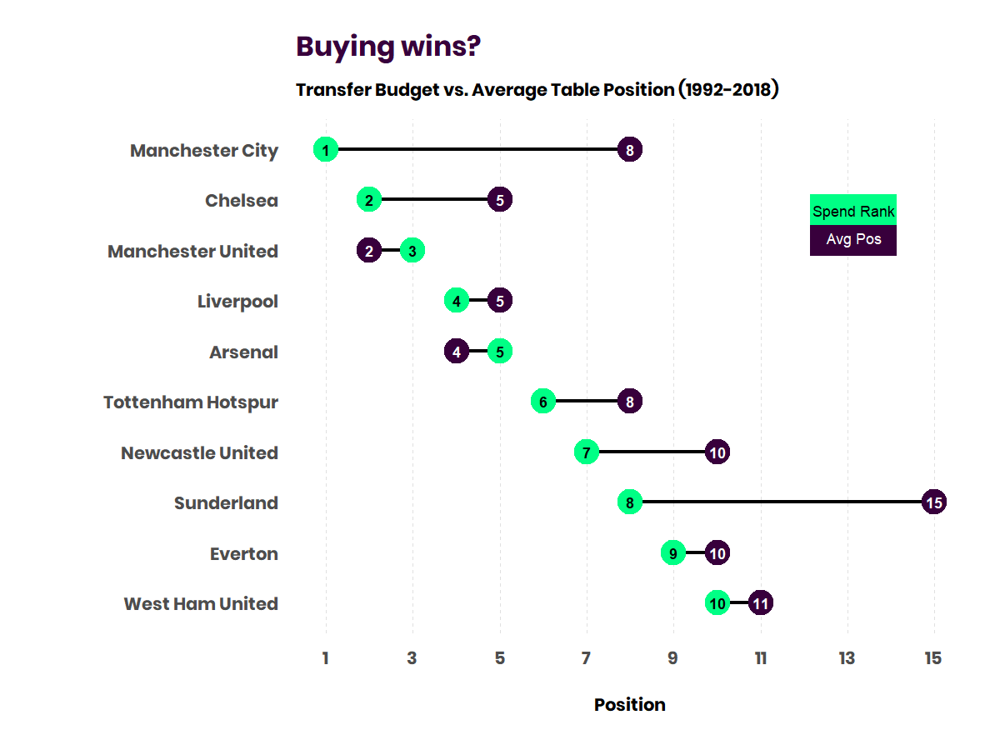
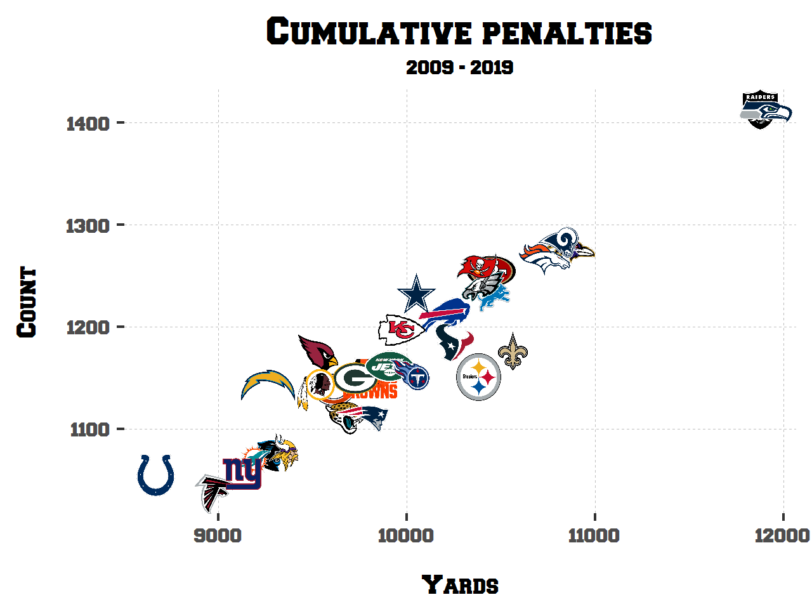
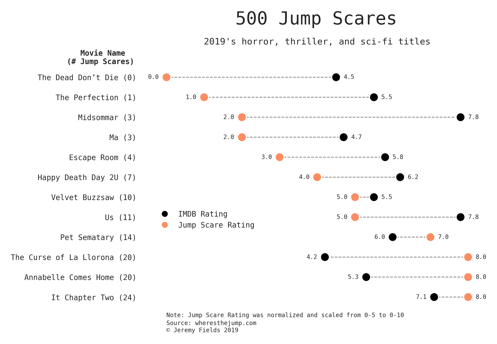

# Jeremy Fields's Data Science Portfolio

Analyses, notebooks, machine learning and general data projects below 👇

## Data Exploration and Analysis

### Does the color of your jersey give you an advantage? 🎨
**An investigation into the colors with the most sports success.** (Python, seaborn)

Data around sports team's primary/secondary colors & number of championships won. Leagues included: NFL, NBA, MLB, NHL, EPL, La Liga, Serie A, NCAAF, NCAAB

Analysis of the data [here](sports-color-success/Analysis.ipynb). You can find the code and data [here](sports-color-success/README.md).

### EPL Transfer Market ⚽
**Does higher spending equate to more winning?** (R, tidyverse)

Contains transfer data and team points totals for the English Premier League from the 1992-93 season through 2018-19.

I analyzed the overall trends of the EPL transfer market [here](epl-transfers/OverallAnalysis.md) and analyzed if higher spending equates to more wins [here](epl-transfers/Analysis.md). Link to full project and more cool plots [here](epl-transfers/README.md).

### NFL Penalties 🏈
**Do the refs play favorites? How have penalties changed year over year?** (R, tidyverse)

Scraped data on NFL penalties from 2009-2019 (as found on [nflpenalties.com](https://www.nflpenalties.com/)). Contains data on specific penalties (false start, holding etc.) & penalties by phase of the game (OFF/DEF/ST).

Analysis on some common penalty questions [here](nfl-penalties/Analysis.md). Link to project [here](nfl-penalties/README.md)

### Movie budgets 🎥
**Who were the small budget cash cows? What actors rake in the most?** (Python, BeautifulSoup)

Scraped data on the top 5000ish highest budget movies ever (as found on [the-numbers.com](https://www.the-numbers.com/movie/budgets/all)). Contains not only data around budget/profit but metadata like: Directors/actors of said movies, theater count, genre, story source (comic, novel etc) and more.

Link to project [here](movie-budgets/README.md)

### Company Colors 🎨
**Do industries have design relationships?** (Python, BeautifulSoup, Selenium)

Contains the brand palettes and logos of Fortune 500 companies. Furthermore, contains a screenshot of said companies websites and the most common colors used on their homepages. This was an odd project/idea for a scraping project but really rewarding to do.

Link to project [here](company-colors/README.md)

### Big 4 League Attendance 🏒🏀🏈⚾
**Do people really rather just watch from home?** (R, tidyverse)

Contains attendance data for the Big 4 US sports leagues from 2001-2019 (NBA, NFL, MLB, NHL).

Link to project [here](big4league-attendance/README.md)

 

## Data Visualizations

**[500 Jump Scares](https://www.reddit.com/r/dataisbeautiful/comments/dei68x/battle_dataviz_battle_for_the_month_of_october/f3vp452/?utm_source=share&utm_medium=web2x), my viz that won the October 2019 r/dataisbeautiful [competition](https://www.reddit.com/r/dataisbeautiful/comments/drgz68/battle_dataviz_battle_for_the_month_of_november/)**

This was created for the October 2019 r/DataIsBeautiful DataViz Battle which centered around visualizing the Jump-Scares for over 500 horror, thriller, and sci-fi movies. I chose to only include 2019 here as this visualization lends itself to a smaller subset of data. Inspired by [aaron penne](https://github.com/aaronpenne/data_visualization/blob/master/ceo_compensation/dot_pairs_ceo_compensation.py)'s dot pairs viz.

This chart shows a larger trend: More jump scares = a higher jump scare rating. Eyeballing the colors alone, it seems that less jumps (count and rating) translates to a higher IMDB score. **Note: this was the winner.**

Code: 2019 dot-pair [here](visualizations/500jumps/scary_dots.py) and all-movie swarm plot [here](visualizations/500jumps/scary_swarm.py).

 

## Kaggle kernels

### Categorical Feature Encoding Challenge
This challenge involved taking a data set solely comprised of categorical features and encoding them while capturing as much useful signal as possible. In this [kernel](https://www.kaggle.com/delafields/a-thorough-guide-on-categorical-feature-encoding) I implemented a thorough range of encoding techniques including feature hashing, likelihood encoding, and sin/cos transforms.

### Tinker, Tailor, Scientist, Analyst
[This kernel](https://www.kaggle.com/delafields/tinker-tailor-scientist-analyst) sought to provide contextual evidence to the often asked "What's the difference between a Data Scientist and a Data Analyst?", given [Kaggle's 2019 ML & DS Survey](https://www.kaggle.com/c/kaggle-survey-2019). Through looking at Demographic questions, Career questions (like education level, work roles, salary), and Tooling Used (favorite algorithms, ML frameworks, langs) - I discovered some lines of separation between the two titles. *TLDR - years of experience, education, and consequentially, salary.*

## Stand-alone Apps

### Favoritify
Not Data Science in the traditional sense (honestly more of a front-end project) but I created this React app, [Favoritify](https://favoritify.herokuapp.com/), that polls the Spotify API for a user's top music and displays a personalized dashboard of visualizations. Includes top tracks/genres/artists, how popular they are globally on average, the typical auditory features of your music, and more. [Code here](https://github.com/delafields/Favoritify). *Not being monitored - if broken please send me a note. That being said, please give it a try!*

## Kaggle competitions
