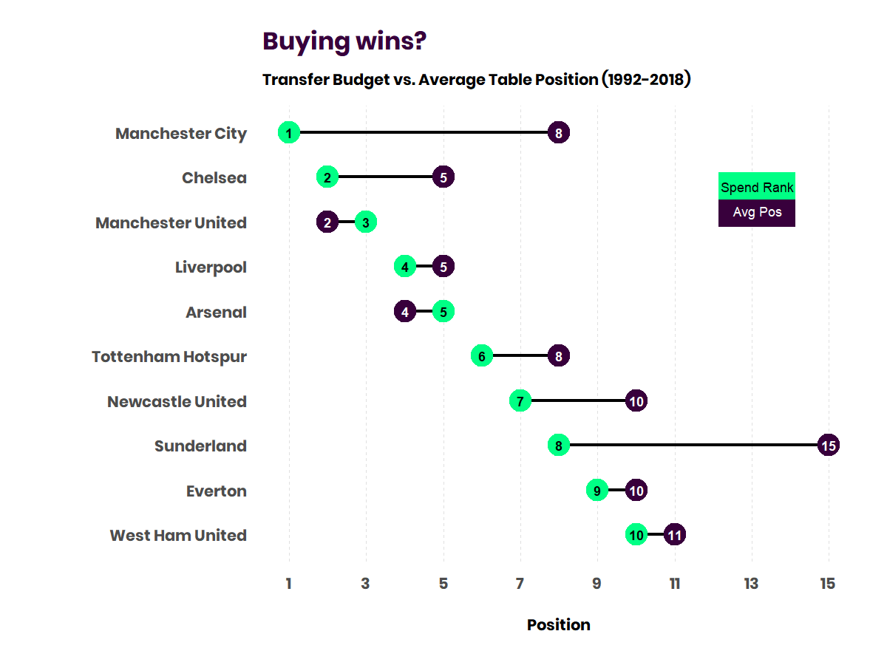
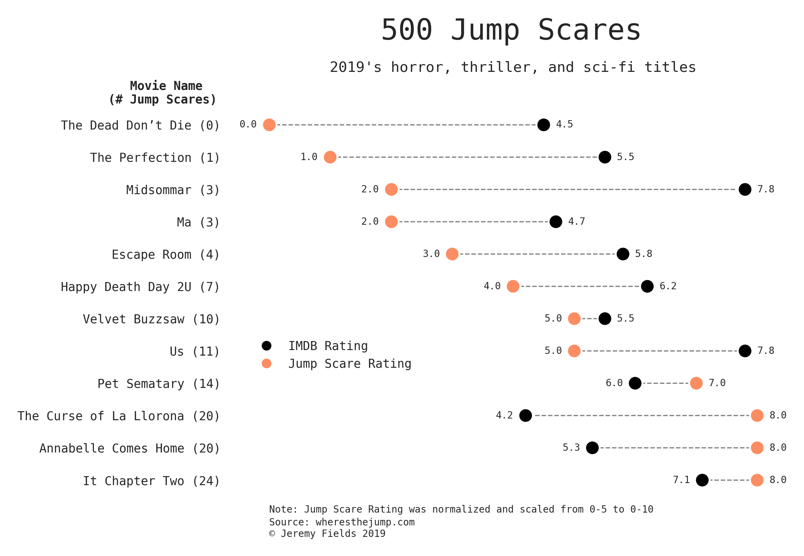
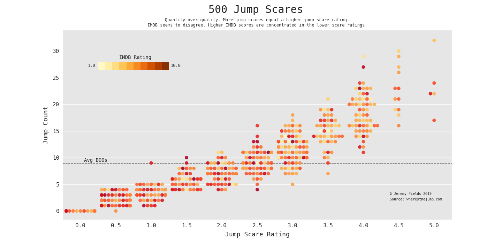

# Jeremy Fields's Data Science Portfolio

This portfolio is a compilation of notebooks & side projects I've created for data analysis or for exploration of machine learning algorithms. You can find stand-alone projects at the top.

## Stand-alone 

### Favoritify
Not Data Science in the traditional sense (honestly more of a front-end project) but I created this React app, [Favoritify](https://favoritify.herokuapp.com/), that polls the Spotify API for a user's top music and displays a personalized dashboard of visualizations. Includes top tracks/genres/artists, how popular they are globally on average, the typical auditory features of your music, and more. Honestly, it's pretty sweet. [Code here](https://github.com/delafields/Favoritify). *Not being monitored - if broken please send me a note. That being said, please give it a try!*

## Data Exploration and Analysis

### Movie budgets 🎥
**Who made the most on the smallest budget? What actors rake in the most dough?**

Scraped data on the top 5,000 (about) biggest budget movies ever (as found on[the-numbers.com](https://www.the-numbers.com/movie/budgets/all)). Contains a trove of information not only around budget/profit but Directors/actors of said movies, theater count, genre, story source (comic, novel etc) and more.

Link to project [here](https://github.com/delafields/data-projects/tree/master/movie-budgets)

### NFL Penalties 🏈
**Who do the zebras like? How have penalties changed year over year?**

Scraped data on NFL penalties from 2009-2018 (as found on [nflpenalties.com](https://www.nflpenalties.com/)). Contains data on specific penalties (false start, holding etc.) but also penalties by phase of the game (OFF/DEF/ST).

Link to project [here](https://github.com/delafields/data-projects/tree/master/epl-transfers)

### Company Colors 🎨
**Do certain industries have a design relationship?**

Contains the brand palettes and logos of Fortune 500 companies. Furthermore, contains a screenshot of said companies websites and the most common colors used on their homepages. This was a real alternative scraping project that was really rewarding to do.

Link to project [here](https://github.com/delafields/data-projects/tree/master/company-colors)

### EPL Transfers ⚽
**Does spending = winning?**

Contains transfer data and scraped year-end results for the English Premier League from the 1992-93 season through 2018-19.

I analyzed the modern transfer market [here](https://www.jfields.me/blog/are-premier-league-teams-spending-wisely). Some more visuals can be found on [website](https://www.jfields.me/blog/the-epl-s-modern-transfer-market-in-data). Link to full project and more cool plots [here](https://github.com/delafields/data-projects/tree/master/epl-transfers).

### Big 4 League Attendance 🏒🏀🏈⚾
**Are people leaving the couch?**

Contains attendance data for the Big 4 US sports leagues from 2001-2019 (NBA, NFL, MLB, NHL).

Link to project [here](https://github.com/delafields/data-projects/tree/master/big4league-attendance)

## Data Visualizations
**[500 Jump Scares](https://www.reddit.com/r/dataisbeautiful/comments/dei68x/battle_dataviz_battle_for_the_month_of_october/f3vp452/?utm_source=share&utm_medium=web2x), my viz that won the October 2019 r/dataisbeautiful [competition](https://www.reddit.com/r/dataisbeautiful/comments/drgz68/battle_dataviz_battle_for_the_month_of_november/)**

This was created for the October 2019 r/DataIsBeautiful DataViz Battle which centered around visualizing the Jump-Scares for over 500 horror, thriller, and sci-fi movies. I chose to only include 2019 here as this visualization lends itself to a smaller subset of data. Inspired by [aaron penne](https://github.com/aaronpenne/data_visualization/blob/master/ceo_compensation/dot_pairs_ceo_compensation.py)'s dot pairs viz.

This chart shows a larger trend: More jump scares = a higher jump scare rating. Eyeballing the colors alone, it seems that less jumps (count and rating) translates to a higher IMDB score. **Note: this was the winner.**

Code: 2019 dot-pair [here](code/500/scary_dots.py) and all-movie swarm plot [here](code/500jumps/scary_swarm.py).

## Problem-based

## Kaggle competitions

## Kaggle kernels

### Categorical Feature Encoding Challenge
This challenge involved taking a data set *solely* comprised of categorical features and encoding them in a way that captured as much useful signal as possible. Ingested data included binary features, nominal and ordinal features (of varying cardinality) and cyclical features. In this [kernel](https://www.kaggle.com/delafields/a-thorough-guide-on-categorical-feature-encoding) I implemented a thorough range of encoding techniques including feature hashing, likelihood encoding, and sin/cos transforms.

### Tinker, Tailor, Scientist, Analyst
[This kernel](https://www.kaggle.com/delafields/tinker-tailor-scientist-analyst), exploratory in nature, sought to provide contextual evidence to the often asked "What's the difference between a Data Scientist and a Data Analyst?". The dataset used to compile this kernel was [Kaggle's 2019 ML & DS Survey](https://www.kaggle.com/c/kaggle-survey-2019), narrowed down to those who identified as either Analysts or Scientists. Through looking at various Demographic questions, Career questions (like education level, work roles, salary), and Tooling Used (favorite algorithms, ML frameworks, langs) - I discovered some lines of separation between the two titles. *TLDR - years of experience, education, and consequentially, salary.*