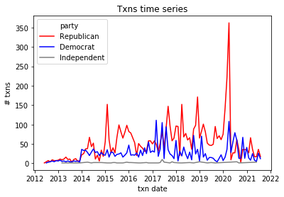

## Senate stock trade forecasting

This was a little time-series experiment. In it, I [downloaded and enhanced](pull_data.ipynb) congressional trade disclosures (senator's, specifically) from [senatestockwatcher.com](https://senatestockwatcher.com/api).

I did some brief [EDA](EDA.ipynb) to look at which parties trade the most, in which value buckets, and the differences between transaction dates and disclosure dates.

Lastly, I used [prophet](https://facebook.github.io/prophet/) to try to forecast future trading and future daydiffs (disclosure dates - transaction dates). This data set did not lend itself to serious forecasting but it was a fun exercise to see if such a powerful model could predict trends.
