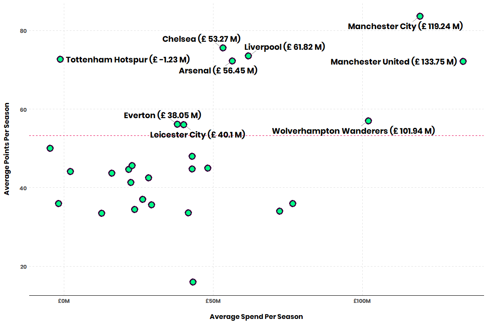
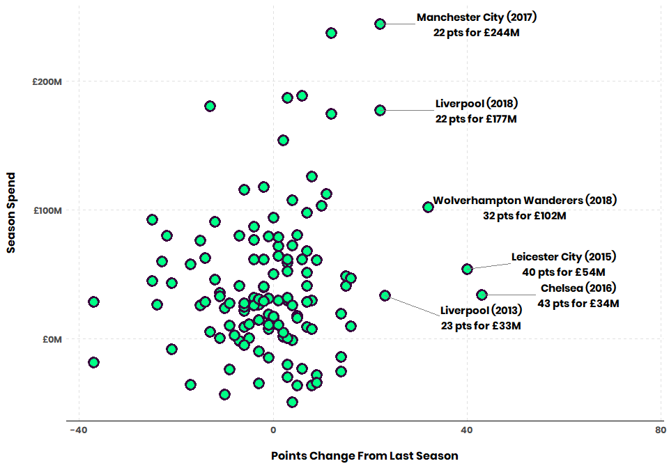
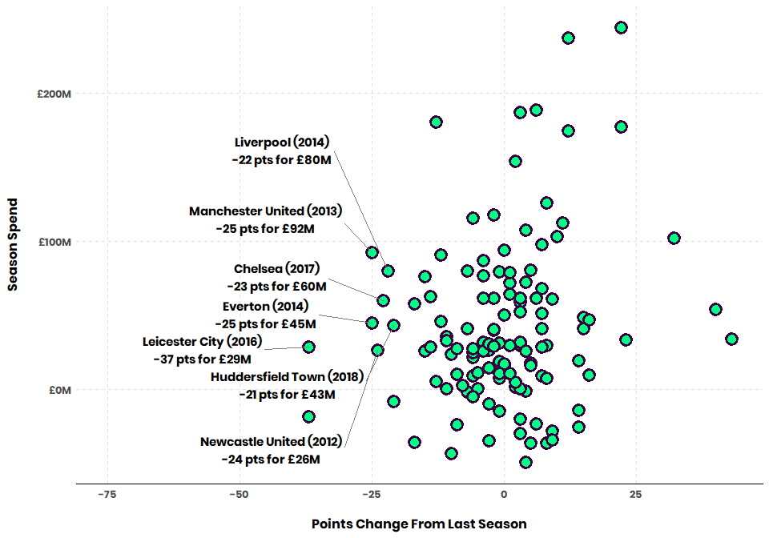
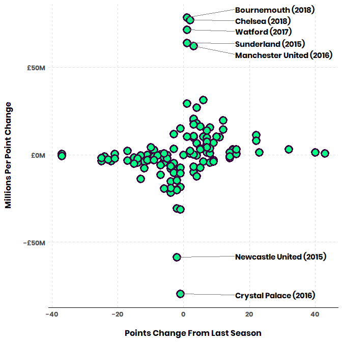
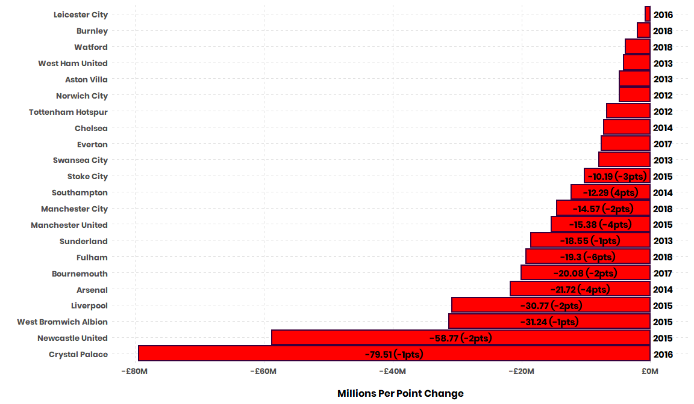
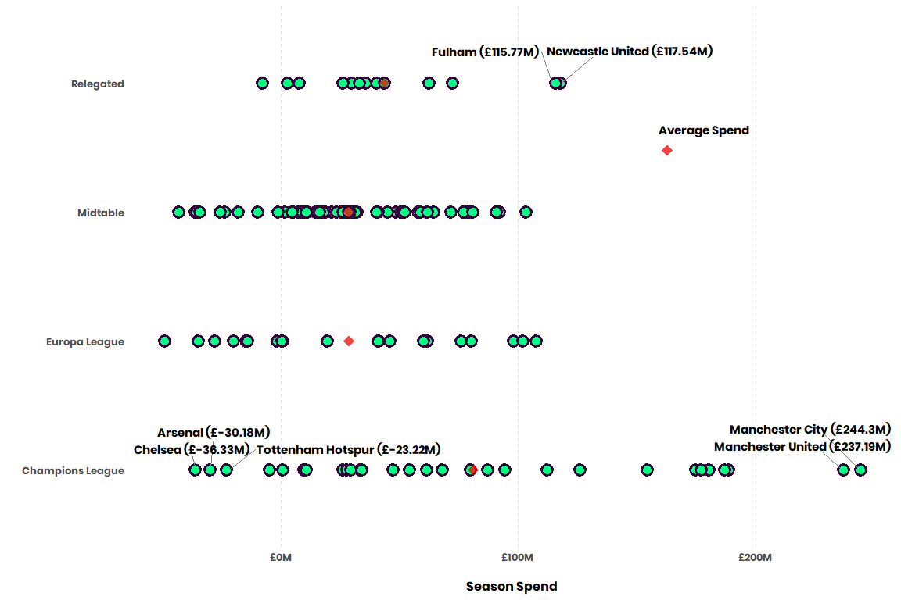

# Who is getting their money's worth in the English Premier League?

In [my last post](https://www.jfields.me/blog/the-epl-s-modern-transfer-market-in-data), I presented a few plots around some data I put together around the EPL's transfer market. Here, I tie the transfer market into the actual season results to see the effect of transfers windows.

All data can be found in my [epl-transfers repo](https://github.com/delafields/data-projects/tree/master/epl-transfers).

## Transfer Trends
I first did some exploration around what the year-over-year trend in £'s spent in the Prem looked like:


The emphasis of this post will be the modern transfer market, so it would be wise to set a cutoff date for it. From the chart above we can clearly see an upward trend starting in 2011 right after a steady crash in 2008 (sports were hurting then too). 

Setting a cutoff year gives us the added benefit of not having to do a lot of work around promotion/relegation. 3 teams get sent up to the EPL from the Championship and vise versa every year, which could skew some of the features we put together later.

## Data Processing

**Skip past the Feature Engineering section if you aren't interested**

First, we'll join results (Wins, Points, Position, etc.) to transfer data (Fee, transfer movement, etc.).
```{}

library(dplyr)
library(stringr)

####### Import data #######

# handy function to merge csvs together
# (via https://stackoverflow.com/questions/30242065/trying-to-merge-multiple-csv-files-in-r/30242347)
multmerge = function(path){
    filenames = list.files(path=path, full.names=TRUE)
    
    datalist = lapply(filenames, function(x){
        read.csv(file = x, header = T)})
    
    Reduce(function(x, y) {merge(x, y, all = TRUE)}, datalist)
}

transfer_data <- multmerge("data/transfer-data")
results_data  <- multmerge("data/epl-results")
inflation <- read.csv(file = "data/Inflation_Adjustment.csv", fileEncoding="UTF-8-BOM")

####### Data Processing #######

transfer_data <- rename(transfer_data, Team = club_name)  # rename `club_name` to `Team` to match results
transfer_data[is.na(transfer_data)] <- 0                  # replace na's

grouped_transfer_data <- transfer_data %>%
  left_join(inflation, by = "year") %>%
  mutate(corrected_fee = ifelse(transfer_movement == "out", 
                                fee_cleaned * -1, 
                                fee_cleaned),                        # negate "out" transfers
         adj_fee = corrected_fee * (1 + .01 * inflation$Inflation),  # adjust for inflation
         Team = str_replace_all(Team, " FC", ""),                    # match results table names
         Team = str_replace_all(Team, "AFC", ""),                    # match results table names
         Team = trimws(Team)) %>%
  group_by(Team, year) %>%
  summarise(total_spend = sum(adj_fee))


results_data <- results_data %>% 
  rename(QualRel = Qualification.or.relegation) %>%
  mutate(Team = str_replace_all(Team, " \\(\\S\\)", ""),  # remove the (C)'s and (R)'s from Team names
         year = as.numeric(substr(year, start = 1, stop = 4)),        # trim year to just the first yyyy
         # bucket into qualification/relegation
         QualRel = case_when(str_detect(QualRel, "Champions League") == TRUE ~ "Champions League",        
                             str_detect(QualRel, "Europa League")    == TRUE ~ "Europa League",
                             str_detect(QualRel, "Relegation")       == TRUE ~ "Relegated",
                             TRUE ~ "Midtable"))

    
# join transfers to results
epl_data <- results_data %>% 
    right_join(grouped_transfer_data, by = c("Team", "year")) %>%
    arrange(year) %>%
    filter(year >= 2011) # our cutoff

head(epl_data)
```

### Feature Engineering

To be able to see how teams results changed as an effect of their spend, we'll create a few new features: `WinChange`, `LossChange`, `GFChange`, `GAChange`, and `PtsChange.` 

* Ex: you have 20 wins in 2013 and 18 wins in 2014, the 2014 `WinChange` will equal -2.

Ultimately we're concered about the effects of spending, so we'll create a few more features. 

* We'll divide all of our `{}Change` features by `total_spend` (the amount spend that season) to get to a feature like `MillPerPtsGained` (how many millions of £ spent per point gained).

## Who's getting their money's worth?

Let's first take a look at what teams have performed above average in this time frame. To do this, we'll look at each club's average spend per season, average points per season, and the historical point average for the EPL.


```{r}
per_team <- epl_data %>%
    group_by(Team) %>%
    summarise(avg_spend               = mean(total_spend),
              total_spend             = sum(total_spend),
              avg_pts                 = mean(Pts),
              avg_pts_change          = mean(PtsChange),
              avg_mill_per_pts_gained = mean(MillPerPtsGained))

historical_pts_average <- results_data %>% 
    mutate(Pts = as.numeric(str_replace_all(Pts, "19[c]", ""))) %>%  # one weird data point
    summarise(mean_pts = mean(Pts, na.rm = TRUE)) %>%
    pull()  


ggplot(per_team, aes(x = avg_spend, y = avg_pts)) +
  geom_point(shape = 21, colour = "#38003c", fill = "#00ff85", size = 4, stroke = 2) +
  geom_hline(yintercept = as.double(historical_pts_average), color="#e90052", linetype="dashed") +
  geom_text_repel(data = subset(per_team, avg_pts > as.double(historical_pts_average)),
                  aes(label = paste(Team, "(£", round(avg_spend, 2), "M)")),
                  point.padding = 0.5, segment.color = "grey50", family = "poppins", size = 5) +
  labs(y = "Average Points Per Season\n", x = "\nAverage Spend Per Season") +
  scale_x_continuous(labels = scales::dollar_format(prefix="£", suffix = "M")) +
  epl_theme

```


The Big 6 are represented well here. That's Arsenal, Liverpool, Chelsea, Manchester United, Manchester City, and Tottenham. The horizontal line is the historical points average, so everyone above that is performing above average. 

Some standout points here:

* City is seeing the most success with the second highest spend
* United spends a ton but haven't separated themselves, points-wise, from the rest of the Big 6
* Tottenham has done the most with the least amount of spend - they actually average a profit in the transfer market (< £0M)

## Investing in change

Season-to-season change in points is the most important measure of improvement, in my opinion. Points depend upon Wins, Losses, and Draws,  to which Goals For and Goals Against play into. Points *also* determine the league winner, european league qualifications, and relegation. **So we'll be looking at points.**

**Let's look at seasons where teams have seen a +20 point swing and how much they spent to get there.**

```{r}

ggplot(epl_data, aes(y = total_spend, x = PtsChange)) +
  geom_point(shape = 21, colour = "#38003c", fill = "#00ff85", size = 4, stroke = 2) +
  geom_text_repel(family = "poppins", direction = "y", segment.color = "grey50", 
                  nudge_x = 20, size = 4, force = 10, 
                  aes(label = ifelse(PtsChange > 20, 
                                     paste(Team, " (", substr(year, start = 1, stop = 4), ")\n",
                                           PtsChange, " pts for £", round(total_spend), "M", sep = ""),
                                     ''))) +
  labs(y = "Season Spend\n", x = "\nPoints Change From Last Season") +
  xlim(NA, 75) + # widen x axis right to fit labels
  scale_y_continuous(labels = scales::dollar_format(prefix="£", suffix = "M")) +
  epl_theme

```


👏👏 for Liverpool (2013), Chelsea, and Leicester taking these huge jumps on a low budget. This also shows where City and Liverpool (2018) kicked off an absolute arms race to the top.

I'm going to highlight some of the players that were bought by the labeled teams:

* City (2018): Aymeric Laporte, Benjamin Mendy, Bernardo Silva, Ederson, Kyle Walker
* Liverpool (2018): Alisson, Naby Keita, Fabinho
* Wolverhampton (2018): Adama Traore, Rui Patricio, Diogo Jota, Raul Jimenez, Joao Moutinho
* Leicester (2015): Shinji Okazaki, **N'Golo Kante**
* Chelsea (2016): Michy Batshuayi, **N'Golo Kante**, David Luiz, Marcos Alonso
* Liverpool (2013): Mamadou Sakho, Iago Aspas, Simon Mignolet

For the most part, these all contain at least one player who became an important part of each one of these teams. Oh and if you want to turn your team around - please sign N'Golo Kante.


**Now let's look at the points where teams have seen a -20 point swing in a season and how much they spent to get there.**

```{r"}
ggplot(epl_data, aes(y = total_spend, x = PtsChange)) +
  geom_point(shape = 21, colour = "#38003c", fill = "#00ff85", size = 4, stroke = 2) +
  geom_text_repel(family = "poppins", direction = "y", segment.color = "grey50", nudge_x = -20, size = 4, force = 20, 
                  aes(label = ifelse((PtsChange < -20 & total_spend > 0), 
                                     paste(Team, " (", substr(year, start = 1, stop = 4), ")\n" ,
                                           PtsChange, " pts for £", round(total_spend), "M", sep = ""),
                                     ''))) +
  labs(y = "Season Spend\n", x = "\nPoints Change From Last Season") +
  scale_y_continuous(labels = scales::dollar_format(prefix="£", suffix = "M")) +
  xlim(-75, NA) + # open the negative x axis to fit the labels
  epl_theme
```


All of the highlighted points are tragic falls...but the Liverpool and Manchester United points are especially bad - they couldn't stop the bleeding with > £80M. 

Who'd they spend on here?

* United (2013): 	Marouane Fellaini, Juan Mata
* Liverpool (2014): Adam Lallana, Dejan Lovren, Lazar Markovic, Mario Balotelli
* Chelsea (2017): Álvaro Morata, Tiémoué Bakayoko, Danny Drinkwater, Antonio Rüdiger
* Everton (2014): Romelu Lukaku, 	James McCarthy

Mostly duds, some squad players. Everton's Lukaku signing is probably the best here - they're just a bit cursed.

*Only highlighting the transfers of these 4 teams because the spend by the others isn't anything crazy.*

## Burning cash

Let's look at who has spent the most & least for small point swings. 

Unlike the last few plots, we'll look at how many millions a team spent for each unit change in points. We'll label teams who've spent > £50M for small point changes.

```{r}

ggplot(epl_data, aes(y = MillPerPtsGained, x = PtsChange)) +
  geom_point(shape = 21, colour = "#38003c", fill = "#00ff85", size = 4, stroke = 2) +
  geom_text_repel(family = "poppins", direction = "y", xlim = c(15, NA), segment.color = "grey50",
                  aes(label = ifelse(abs(MillPerPtsGained) > 50, 
                                     paste(Team, " (", substr(year, start = 1, stop = 4), ")", sep = ""),
                                     ''))) +
  labs(y = "Millions Per Point Change\n", x = "\nPoints Change From Last Season") +
  scale_y_continuous(labels = scales::dollar_format(prefix="£", suffix = "M")) +
  epl_theme

```


**How to read this plot**, taking United (2016) as an example: They spent ~£186M only to gain 3 points, meaning they spent about ~£62M per point gained. Newcastle and Palace represent > £50M spent per point *lost*.

**All of the labeled teams represent completely sterile transfer impact.**

## Twisting The Knife - each team's worst business season

Let's look at each team's smallest `MillPerPtsGained` - this should show the season where they've spent the most for a drop in points. 

To allow for a larger sample size of transfer windows, we'll only look at team's who have been in the Prem for over 2 seasons.

```{r}

worst_season <- epl_data %>%
  add_tally() %>%
  group_by(Team) %>%
  filter(n > 2 &  MillPerPtsGained == min(MillPerPtsGained))


ggplot(worst_season, aes(x = reorder(Team, MillPerPtsGained), y = MillPerPtsGained)) +
  geom_bar(stat = "identity", size = 1, color="#38003c", fill = ifelse(worst_season$MillPerPtsGained > 0, "#00ff85", "red")) +
  coord_flip() + 
  geom_text(position = position_stack(vjust = 0.5), family = "poppins", size = 4,
            aes(label = ifelse(abs(MillPerPtsGained) > 10, # to fit in the bars
                               paste(round(MillPerPtsGained, 2), " (", PtsChange, "pts)", sep = ""),
                               ""))) +
  geom_text(position=position_dodge(width=0.9), family = "poppins", 
            aes(y = 2, label = ifelse(MillPerPtsGained < 0,
                               as.numeric(substr(year, start = 1, stop = 4)),
                               ""))) +
  labs(y = "\nMillions Per Point Change", x = "") +
  scale_y_continuous(labels = scales::dollar_format(prefix="£", suffix = "M")) +
  epl_theme + theme(axis.line.x = element_blank())

```


If you're a supporter, I encourage you to go and explore who was bought in your poorest spending season. I'm sure you vividly remember the elation of new transfers and the pain of them not panning out immediately.

## Can you buy your way into the Champions League?

Premier League teams have goals outside of winning the league itself. They also look to qualify for the Champions League (by ranking 1-4), qualify for the Europa League (by ranking 5-6), and avoid relegation (ranking 18-20). 

Let's look at the effect of spend on these qualifications:

```{r}

average_QualRel <- epl_data %>% group_by(QualRel) %>% summarise(total_spend = mean(total_spend))

ggplot(epl_data, aes(x = total_spend, y = QualRel, size = 3)) + 
  geom_point(shape = 21, colour = "#38003c", fill = "#00ff85", size = 4, stroke = 2) + 
  geom_point(data = average_QualRel, color = "red", shape = "diamond", alpha = 0.75) +
  geom_text_repel(aes(label = paste(Team, " (£", round(total_spend, 2), "M)", sep = "")),
                  data = subset(epl_data, 
                                (QualRel == "Champions League" & total_spend < -10) | 
                                (QualRel == 'Champions League' & total_spend > 200) | 
                                (QualRel == "Relegated" & total_spend > 100)),
                  point.padding = 0.5, segment.color = "grey50", family = "poppins", 
                  show.legend = FALSE, nudge_y = 0.25, size = 4) +
  labs(x = "\nSeason Spend", y = "", size="Average Spend") +
  scale_x_continuous(labels = scales::dollar_format(prefix="£", suffix = "M")) +
  epl_theme + 
  theme(panel.grid.major.y = element_blank(), legend.text = element_blank(), legend.position = c(0.75,0.75))

```


Of the points I've labeled, the top right are **bad performances**, you spent a ton and still got relegated. The points in the bottom left are **good performances**, you made £ on the transfer market, made the Champions League (and got some dough from that).

For the uninformed - teams get a [nice purse](https://www.uefa.com/insideuefa/stakeholders/clubs/news/newsid=2616265.html) from making the Champions League followed by a smaller but still lucrative purse from the Europa League. Teams are clearly willing to invest in this goal as we see from the average spend of Champions League qualifiers.

Although it's skewed by a small sample size and those poor Fulham and Newcastle campaigns, it's fascinating to see that relegated teams, on average here, spend more than midtable and Europa League squads.

That's all! Let me know if you learned anything or if I brought back any painful memories.

**COYG**