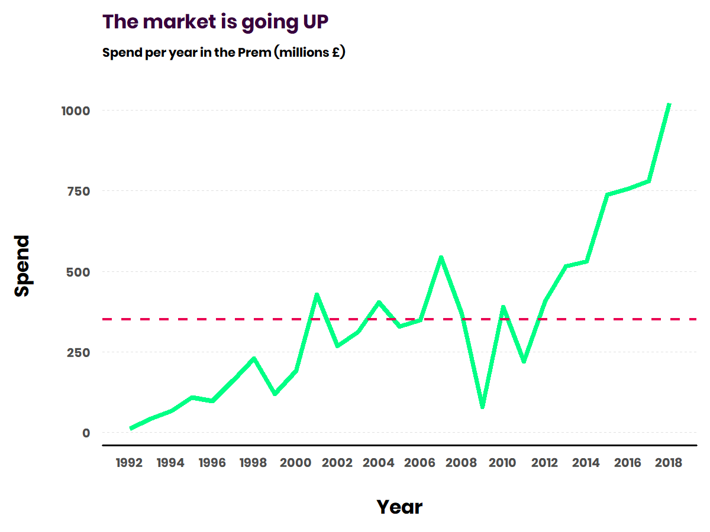
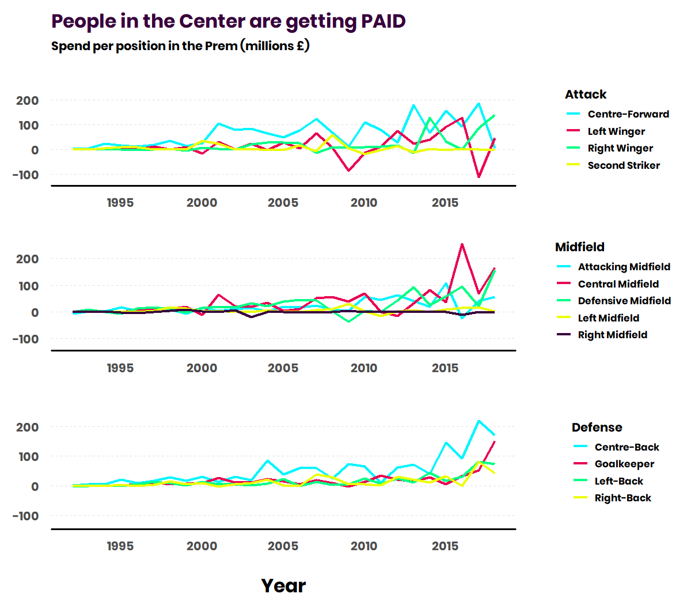
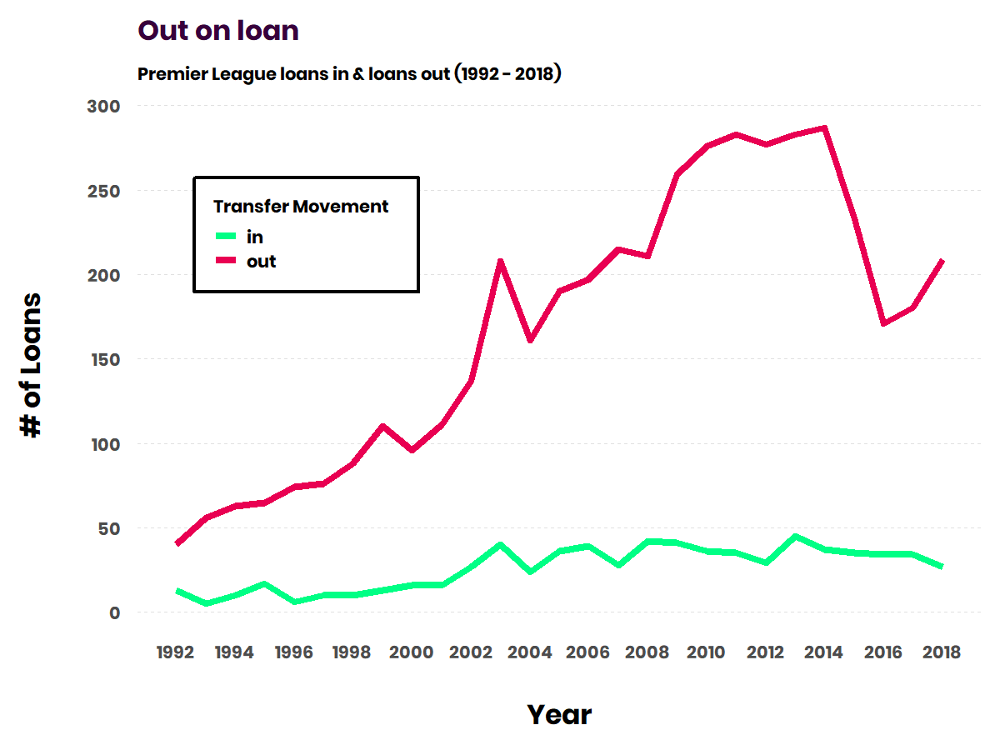
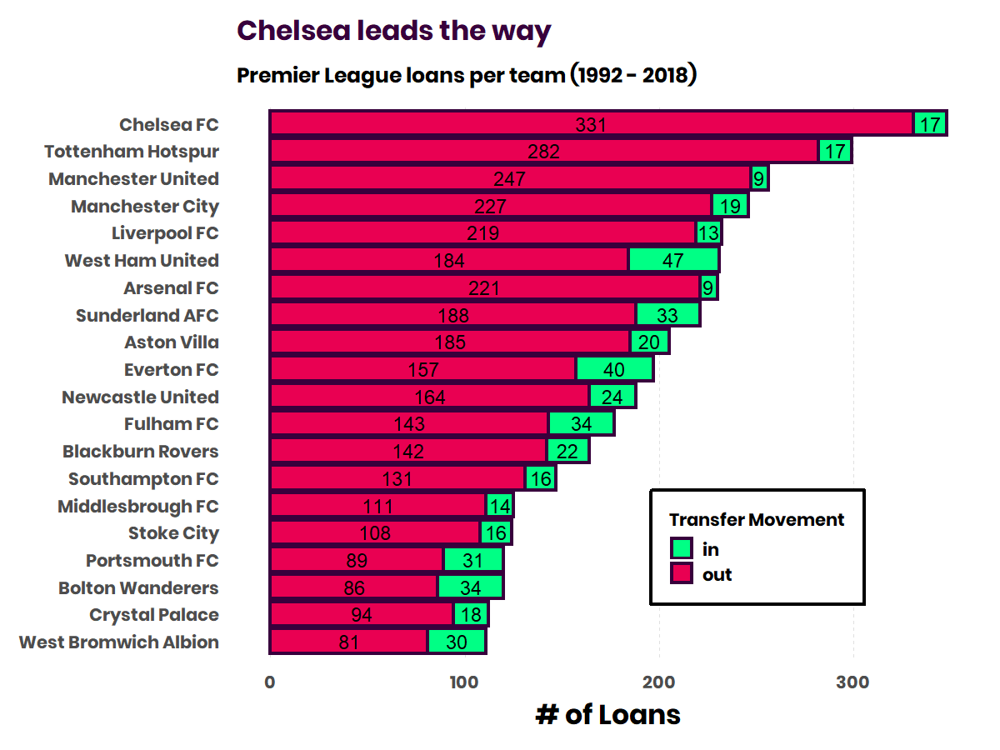

# The EPL's modern transfer market

There’s a lot to say about the soccer/football’s current transfer
market. One indisputable point? Transfer prices have blown through the
roof. Let’s check the numbers.

To get data around **transfers**, I forked
@[ewenme’s](https://github.com/ewenme) awesome
[repo](https://github.com/ewenme/transfers) which contains transfer data
scraped from [Transfermarkt](https://www.transfermarkt.co.uk/). For
**season-end results tables**, I scraped Wikipedia.

Note, both sets of data range from the 1992-93 season to the 2018-19
season.

-   1992-93 because that’s the year the league was formally branded as
    the EPL
-   2018-19 because that’s the last complete year at the time of writing

All data can be found in my [epl-transfers
repo](https://github.com/delafields/data-projects/tree/master/epl-transfers).

Here’s the kind of stuff you can quickly zip together with it:

### How has league spending changed?

👆 those figures are all inflation adjusted too. It’s really neat to see
the tangible drop from the 2008 financial market crash and the
subsequent explosion in spending on transfers.

### What positions is the money being spent on?

These are definitely spikey due to big transfer splashes but in the most
technical terms - the spikes are getting bigger. It’s interesting to see
the steady growth of the Centre-Back market which probably was probably
proliferated by Liverpool’s signing of Virgil van Djik. Can you find
who’s responsible for the huge spike in Central Midfielders in 2016?

Were they wise investments?
---------------------------

This was more of an exercise in plotting but this can be read as
follows:

-   The green circles represent ranks of amount spent, summed over
    1992-2018.  I chose not to average this due to pro/rel throwing the calculations off.
-   The deep purple circles represent average position in the table.

City’s Avg Pos is a bit skewed due to their historical mid-table
performance, combined their more recent spending under owner Sheikh
Mansour. United, Liverpool, and Arsenal show real consistency in both
spend and performance. Chelsea gets a bit less bang for their buck.
Sunderland really hasn’t performed to the size of their pockets.

### Not just buying and selling - what about loans?

I wouldn’t really expect there to be an equivalent spike in spend on
loanees - that’s all intuition (might be something worth exploring
though). What I looked into was how many loans were being conducted
year-over-year.

There is a clear increasing trend in Premier League teams loaning more
players out every year, minus the drop from 2014 - 2016. I think the
credit for this is due to one of two things

1.  The constantly improving youth academies in the league; with loans
    being a great way to develop young talent.
2.  With the explosion of transfer spend, loans become a way to offload
    players that haven’t worked out.

### Who’s doing the loaning?

No surprise that Chelsea and the Big 6 are at the top of the loan out
chart for the reasons I mentioned above.

For loans in, there are a fair number of middle/lower end of the table
clubs (no offense) (but offense meant for Stoke). This is probably due
to their inability to make huge transfer splashes.

Let me know if you put anything cool together with the data. There are a
lot of nuanced ways you can cut this stuff. I’ll be following up with a
post using the transfer data in combination with the results data to see
who gets the most bang for their buck.