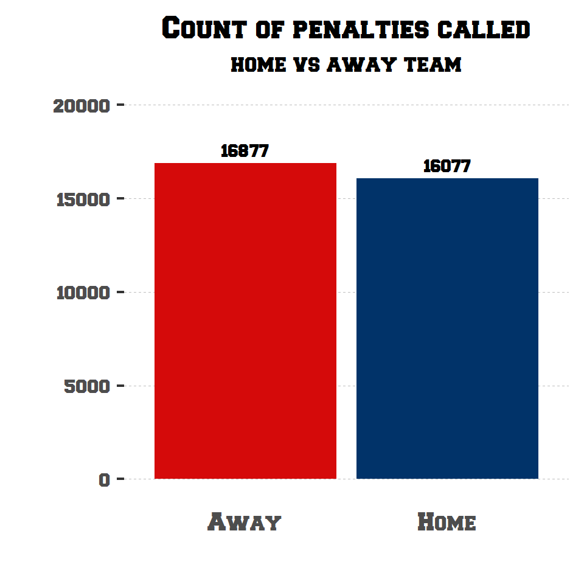
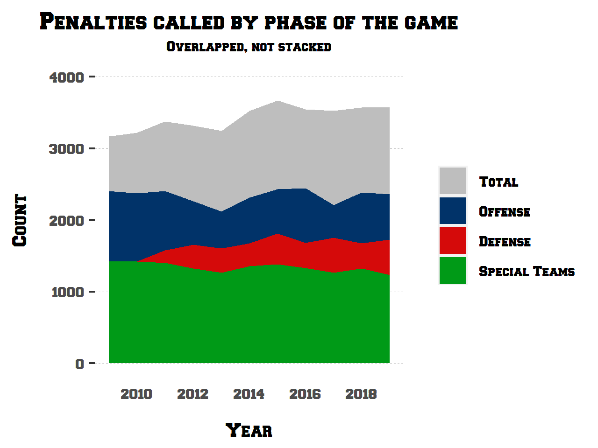
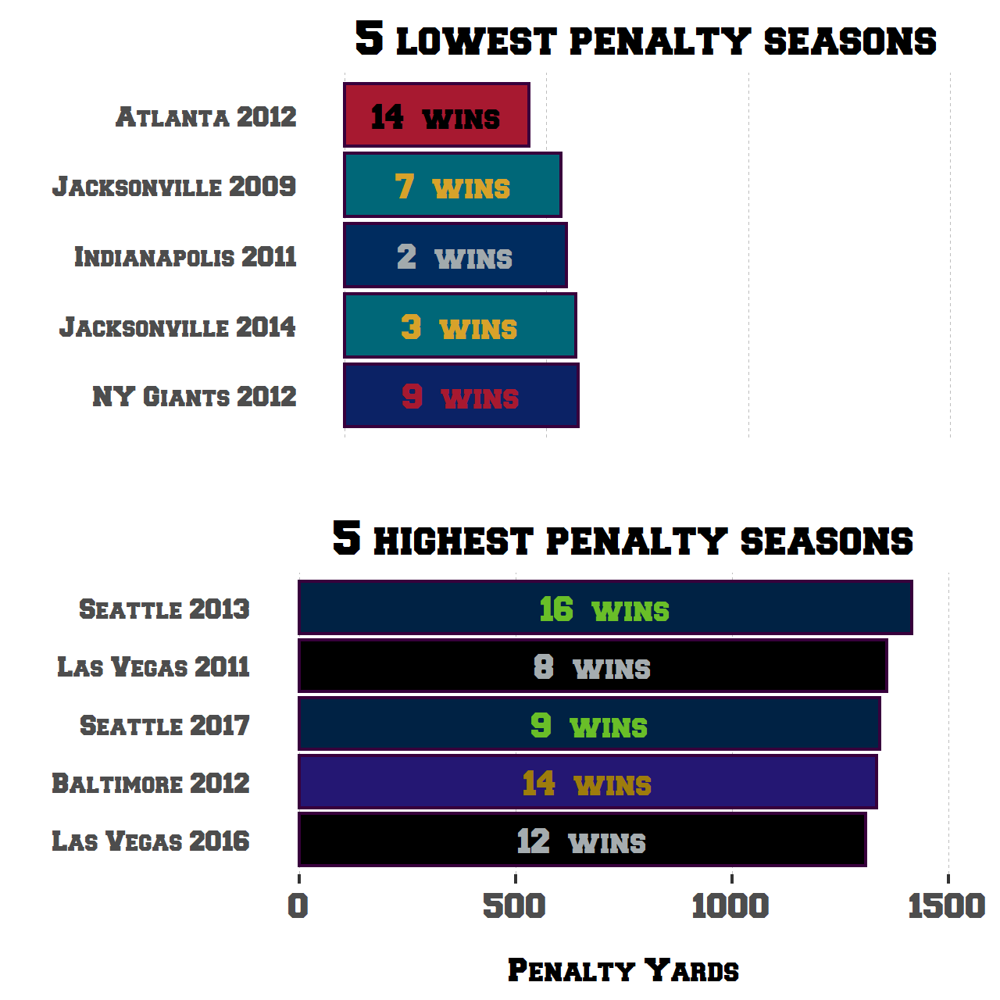

# NFL Penalties (2009-2019)

A few years ago I scraped NFL penalty data from nflpenalties.com. The following is a brief analysis of some of the data.

### Step 1: Import packages:
```
library(tidyverse)
library(readxl)
library(reshape2)
library(ggimage)
library(rsvg)
library(cowplot)
```

### Step 2: Read in the data

There are two main data files here

* by_team_group: seasonal penalty data by offense, defense, special teams
* by_penalty: seasonal penalty data by penalty type

```
# penalties by phase of the game (offense, defense, total)
phase_of_game_file <- 'by_team_group.xlsx'

sheets <- excel_sheets(phase_of_game_file)

pens_by_phase <- map_df(sheets, ~ read_excel(phase_of_game_file, sheet = .x))

pens_by_phase %>% head(1)
```

```
# penalties by penalty type
penalty_file <- 'by_penalty.xlsx'

sheets <- excel_sheets(penalty_file)

penalties_by_type <- map_df(sheets, ~ read_excel(penalty_file, sheet = .x))

penalties_by_type %>% head(1)
```

```
# metadata: team logos
logos <- read_excel("logos.xlsx")

# metadata: wins and loses per team & season
wins <- read_excel('wins_per_year.xlsx')
```

### Step 3: Data Manipulation

```{r}
###################################
# phase of game file manipulation #
###################################

# standardize team names
pens_by_phase <- pens_by_phase %>% 
  mutate(Team = replace(Team, Team == 'N.Y. Giants', 'NY Giants'),
         Team = replace(Team, Team == 'N.Y. Jets', 'NY Jets'),
         Team = replace(Team, Team == 'St. Louis', 'LA Rams'),
         Team = replace(Team, Team == 'Oakland', 'Las Vegas'),
         Team = replace(Team, Team == 'San Diego', 'LA Chargers'))

# fold Presnap counts into their overall phase's count and drop the presnap columns
pens_by_phase <- pens_by_phase %>% 
  mutate(`Off Ct` = `Off Ct` + `Off Presnap`,
         `Def Ct` = `Def Ct` + `Def Presnap`,
         `ST Ct` = `ST Ct` + `Off Presnap`)

# total penalty count & yardage per year
phase_totals_per_year <- filter(pens_by_phase, Team == 'Totals') %>% 
  select(`Total Ct`, `Total Yds`, 
         `Off Ct`, `Off Yds`, 
         `Def Ct`, `Def Yds`,
         `ST Ct`, `ST Yds`,
         `Year`)


# melt the count & yardage columns down
phase_totals_per_year <- melt(phase_totals_per_year %>% mutate(Year = as.integer(Year)), id.vars=c("Year"), value.name = "Yds")


# split out yardage & penalty count
phase_totals_per_year_count <- filter(phase_totals_per_year, variable == "Total Ct" | variable == "Off Ct" | 
                                                             variable == "Def Ct" | variable == "ST Ct") %>% rename(Count = Yds)

phase_totals_per_year_yards <- filter(phase_totals_per_year, variable == "Total Yds" | variable == "Off Yds" | 
                                                             variable == "Def Yds" | variable == "ST Yds")

# non-totals: remove the Total rows from the df
phase_per_year <- filter(pens_by_phase, Team != 'Totals')

# total penalties by team over the entire dataset
team_totals <- phase_per_year %>% 
  group_by(Team) %>% 
  summarise(`Total Ct` = sum(`Total Ct`),
            `Total Yds` = sum(`Total Yds`))

# add logo metadata for plotting
team_totals <- merge(team_totals, logos, by="Team")


################################
# by penalty file manipulation #
################################

penalties_by_type <- penalties_by_type %>%
  rename(Team = Name) %>% 
  mutate(Team = replace(Team, Team == 'N.Y. Giants', 'NY Giants'),
         Team = replace(Team, Team == 'N.Y. Jets', 'NY Jets'),
         Team = replace(Team, Team == 'St. Louis', 'LA Rams'),
         Team = replace(Team, Team == 'Oakland', 'Las Vegas'),
         Team = replace(Team, Team == 'San Diego', 'LA Chargers'))

# totals per year
penalty_totals <- filter(penalties_by_type, Team == 'Totals') %>%
  mutate(Home = as.numeric(Home),
         Away = as.numeric(Away),
         Count = as.numeric(Count))

# remove the Total rows from the df
penalties <- filter(penalties_by_type, Team != 'Totals')
                    
# totals for home and away penalties
home_or_away <- penalty_totals %>%
  select(`Year`, `Home`, `Away`) %>%
  pivot_longer(!Year, names_to="HomeAway", values_to='Count') %>% 
  group_by(HomeAway) %>% 
  summarise(Count = sum(Count))


# year over year differences in penalties
yoy_penalty_change <- penalty_totals %>%
  group_by(Penalty) %>% 
  mutate(`YoY Count Change` = Count - lag(Count, default = Count[1])) %>% 
  mutate(`YoY % Change` = Count / lag(Count, default = Count[1]))

```

Step 4: Plotting & Analysis

*Note, plotting code can be found in [Analysis.Rmd](Analysis.Rmd)*

## Who get's penalized the most?

Pretty much any fan is going to tell you its their team. The fact of the matter is, that can't be true for everyone! Let's see who it is true for:


**Observations**

* I'm a little surprised at how linear this plot is. I assumed that some teams would have a greater than average number of costly penalties, like DPI, and would skew them along the y-axis. I guess on a macro scale things mellow out.
* Seattle and Oakland are *really* outliers here. They don't have a track record of having the most discipline-y coaches, though, so not a huge surprise
* As a Ravens fan, not entirely surprised to see us inching towards the top.

## Home Field Advantage?

In any sport, there's a classic notion that refs tend to treat the home team better than the away team. This could be true or being a visitor and dealing with the crowd could be disruptive, who knows. Either way, let's check the validity of that notion.



So...yeah, the difference is there but it's only 800 (or 1.05%) over an 11 season period. Nothing *huge*.

# Who's to blame?

Offense, defense, or special teams? There's talk that the game is softer now, I think most of that opinion would say that the defense is penalized more often.



This is a relatively mellow plot.

* First, I'm genuinely surprised there's no major upward trend in penalties called. That goes against what I feel like I've seen in games.
* Second, against what I assumed before plotting, NFL offenses are the most highly penalized phase of the game.

# Highest and lowest penalized seasons

Let's look at the most penalized and least penalized seasons over the life of our dataset and whether that has an effect on wins and losses.

```{r}
# top 5 and bottom 5 seasons by penalty yardage
best_worst <- bind_rows(pens_by_phase %>% slice_max(`Total Yds`, n=5),
                        pens_by_phase %>% slice_min(`Total Yds`, n=5))

# join to the wins file
best_worst <- merge(best_worst, wins, by=c("Year", "Team")) %>% 
  arrange(desc(`Total Yds`)) %>% 
  mutate(Team = paste(Team, Year,sep=" "))

best <- best_worst %>% slice_min(`Total Yds`, n=5)
worst <- best_worst %>% slice_max(`Total Yds`, n=5)
```



This all seems...ass-backwards?

* Outside of Atlanta in 2012, the 5 teams with the lowest penalty yardage totals in a season had either mediocre seasons or straight up poor seasons
* Conversely, the top 5 most penalized seasons were all above .500, let alone a 12, 14, and 16 win season! 


Or maybe penalty yardage doesn't matter as much as I thought it did.